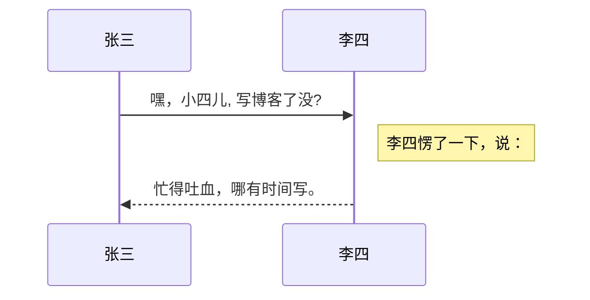

#目录
- **Markdown和扩展Markdown简洁的语法**
- **代码块高亮**
- **图片链接和图片上传**
- ***LaTex*数学公式**
- **UML序列图和流程图**
- **离线写博客**
- **导入导出Markdown文件**
- **丰富的快捷键**

-------------------

## 快捷键

 - 加粗    `Ctrl + B` 
 - 斜体    `Ctrl + I` 
 - 引用    `Ctrl + Q`
 - 插入链接    `Ctrl + L`
 - 插入代码    `Ctrl + K`
 - 插入图片    `Ctrl + G`
 - 提升标题    `Ctrl + H`
 - 有序列表    `Ctrl + O`
 - 无序列表    `Ctrl + U`
 - 横线    `Ctrl + R`
 - 撤销    `Ctrl + Z`
 - 重做    `Ctrl + Y`

## Markdown及扩展

> Markdown 是一种轻量级标记语言，它允许人们使用易读易写的纯文本格式编写文档，然后转换成格式丰富的HTML页面。    —— <a href="https://zh.wikipedia.org/wiki/Markdown" target="_blank"> [ 维基百科 ]

使用简单的符号标识不同的标题，将某些文字标记为**粗体**或者*斜体*，创建一个[链接](http://www.csdn.net)等，详细语法参考帮助？。

本编辑器支持 **Markdown Extra** , 　扩展了很多好用的功能。具体请参考[Github][2].  

### 标题
标题是每篇文章都需要也是最常用的格式，在Markdown中，如果一段文字被定义为标题，只要在这段文字前加#号即可
# 一级标题
## 二级标题 
### 三级标题
#### 四级标题
##### 五级标题
###### 六级标题
以此类推，总共六级标题，建议在井号后加一个空格，这是最标准的Markdown语法。
等号及减号也可以进行标题的书写，不过只能书写二级标题，并且需要写在文字的下面，减号及等号的数量不会影响标题的基数，如下：
```
二级标题
=========

二级标题
---------
```
二级标题
=========

二级标题
---------
***
#### 列表
熟悉HTML的同学肯定知道有序列表与无序列表的区别，在Markdown下，列表的显示只需要在文字前加上-或*即可表为无序列表，有序列表则直接在文字前加1.2.3.符号要和文字之间加上一个字符的空格。
#### 无序列表

- 1
- 2
- 3
#### 有序列表
1. 1
2. 2
3. 3

***
### 引用
如果你需要引用一小段别处的句子，那么就要用引用的格式。
> 例如这样

只需要在文本前加入>这种尖括号（大于号）即可。（要注意符号和文本间的空格）
***
### 图片与链接
插入图片的地址需要图床，这里推荐CloudApp的服务，生成URL地址即可。
#### 插入链接
`[Baidu](http://baidu.com)`
[Baidu](http://baidu.com)
#### 插入图片

``


***
### 粗体与斜体
Markdown的粗体和斜体也非常简单，用两个**包含一段文字就是粗体的语法，用一个*包含一段文本就是斜体的语法。
例如：**这里是粗体** *这里是斜体*
***
### 表格

**Markdown　Extra**　表格语法：

项目     | 价格
-------- | ---
Computer | $1600
Phone    | $12
Pipe     | $1

可以使用冒号来定义对齐方式：

| 项目      |    价格 | 数量  |
| :-------- | --------:| :--: |
| Computer  | 1600 元 |  5   |
| Phone     |   12 元 |  12  |
| Pipe      |    1 元 | 234  |

表格是我觉得Markdown比较累人的地方，例子如下：
```
| Tables        | Are           | Cool  |
| ------------- |:-------------:| -----:|
| col 3 is      | right-aligned | $1600 |
| col 2 is      | centered      |   $12 |
| zebra stripes | are neat      |    $1 |
```
这种语法生成的表格如下：
| Tables        | Are           | Cool  |
| ------------- |:-------------:| -----:|
| col 3 is      | right-aligned | $1600 |
| col 2 is      | centered      |   $12 |
| zebra stripes | are neat      |    $1 |
***
###定义列表

**Markdown　Extra**　定义列表语法：
项目１
项目２
:   定义 A
:   定义 B

项目３
:   定义 C

:   定义 D

	> 定义D内容

***
### 代码块
代码块语法遵循标准markdown代码，例如：
（在需要高亮的代码块的前一行及后一行使用三个反引号```` ```，同时第一行反引号后面表面代码块所使用的语言）
```python
@requires_authorization
def somefunc(param1='', param2=0):
    '''A docstring'''
    if param1 > param2: # interesting
        print 'Greater'
    return (param2 - param1 + 1) or None
class SomeClass:
    pass
>>> message = '''interpreter
... prompt'''
```
***
### 代码框
如果你是个程序员，需要在文章里优雅的引用代码框。在Markdown下实现也非常简单，只需要用两个
```` ```（反单引号）把中间的代码包裹起来，如：
`code`。
使用tab键即可缩进。
***
### 分割线与删除线
可以在一行中用三个以上的星号、减号、底线来建立一个分隔线，同时需要在分隔线的上面空一行。如下：
***

---

___
删除线的使用，在需要删除的文字前后各使用两个符合“~”，如下

~~Mistaken text.~~
###脚注
生成一个脚注[^footnote].
  [^footnote]: 这里是 **脚注** 的 *内容*.
  
***
### 目录
用 `[TOC]`来生成目录：

@[toc]
***
### 数学公式
使用MathJax渲染*LaTex* 数学公式，详见[math.stackexchange.com][1].

 - 行内公式，数学公式为：$\Gamma(n) = (n-1)!\quad\forall n\in\mathbb N$。
 - 块级公式：

$$	x = \dfrac{-b \pm \sqrt{b^2 - 4ac}}{2a} $$

更多LaTex语法请参考 [这儿][3].
***
### UML 图:

可以渲染序列图：



或者流程图：

```mermaid
flowchat
st=>start: 开始
e=>end: 结束
op=>operation: 我的操作
cond=>condition: 确认？

st->op->cond
cond(yes)->e
cond(no)->op
```

- 关于 **序列图** 语法，参考 [这儿][4],
- 关于 **流程图** 语法，参考 [这儿][5].
***
## 离线写博客

即使用户在没有网络的情况下，也可以通过本编辑器离线写博客（直接在曾经使用过的浏览器中输入[write.blog.csdn.net/mdeditor](http://write.blog.csdn.net/mdeditor)即可。**Markdown编辑器**使用浏览器离线存储将内容保存在本地。

用户写博客的过程中，内容实时保存在浏览器缓存中，在用户关闭浏览器或者其它异常情况下，内容不会丢失。用户再次打开浏览器时，会显示上次用户正在编辑的没有发表的内容。

博客发表后，本地缓存将被删除。　

用户可以选择 <i class="icon-disk"></i> 把正在写的博客保存到服务器草稿箱，即使换浏览器或者清除缓存，内容也不会丢失。

> **注意：**虽然浏览器存储大部分时候都比较可靠，但为了您的数据安全，在联网后，**请务必及时发表或者保存到服务器草稿箱**。

##浏览器兼容

 1. 目前，本编辑器对Chrome浏览器支持最为完整。建议大家使用较新版本的Chrome。
 3. IE９以下不支持
 4. IE９，１０，１１存在以下问题
    1. 不支持离线功能
    1. IE9不支持文件导入导出
    1. IE10不支持拖拽文件导入

---------

[1]: http://math.stackexchange.com/
[2]: https://github.com/jmcmanus/pagedown-extra "Pagedown Extra"
[3]: http://meta.math.stackexchange.com/questions/5020/mathjax-basic-tutorial-and-quick-reference
[4]: http://bramp.github.io/js-sequence-diagrams/
[5]: http://adrai.github.io/flowchart.js/
[6]: https://github.com/benweet/stackedit